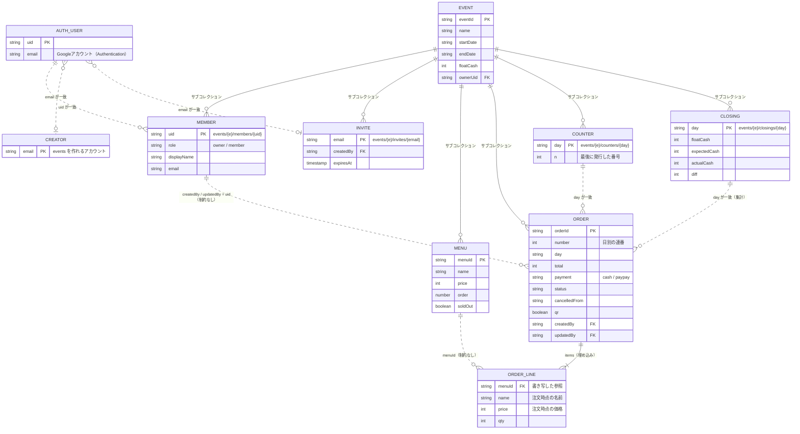

# データ設計

Cloud Firestore のコレクション、項目、制約、インデックス、状態遷移、集計の計算仕様。
アクセス制御は [security-rules.md](./security-rules.md)、読み書きの関数は [data-access.md](./data-access.md)。

## 1. コレクション一覧

```
creators/{email}                          イベントを作れるアカウント（運営者がコンソールで管理）
events/{eventId}                          イベント
  ├─ members/{uid}                        メンバー（アクセス権の正）
  ├─ invites/{email}                      招待（参加で削除）
  ├─ menu/{menuId}                        メニュー
  ├─ orders/{orderId}                     注文
  ├─ counters/{day}                       採番カウンター
  └─ closings/{day}                       レジ締め
```

- `eventId` / `menuId` / `orderId` は、Firestoreの自動ID（20文字）。`orderId` はクライアントで生成する
- `day` は `YYYY-MM-DD`（Asia/Tokyo）。`email` は小文字
- 時刻は、すべて Firestore の `Timestamp`。サーバー時刻は `serverTimestamp()` を使う

### 関係図（ER図）



- **実線**：サブコレクション、または埋め込み（親のパスの配下にある。親があって初めて存在する）
- **点線**：論理的な参照。Firestore には外部キー制約がないため、**参照先が消えても、エラーにならず、残る**
- 削除時の扱い：
  | 参照元 → 参照先 | 参照先が消えたとき |
  |---|---|
  | 注文の `items[].menuId` → メニュー | メニューを削除しても、注文は、書き写した名前・価格のまま残る。集計は、`menuId + price` でまとめ、名前は注文時点のものを使う |
  | 注文の `createdBy` / `updatedBy` → メンバー | メンバーが抜けても、注文は残る。スタッフ画面では、表示名が引けないため、「（退会済み）」と表示する |
  | イベントの配下すべて → イベント | イベントを削除しても、配下は自動では消えない。**アプリが、配下を先に削除する**（data-access.md §7） |
  | 招待・`creators` → アカウント | IDがメールアドレスのため、アカウントが無くても存在できる。参加・イベント作成のときに、ログイン中のメールアドレスと一致するかを、ルールが検証する |
- `COUNTER` / `CLOSING` と `ORDER` は、IDで結ばれていない。同じ `day`（`YYYY-MM-DD`）を持つことで、対応する

## 2. 項目定義

### 2.1 creators/{email}
| 項目 | 型 | 内容 |
|---|---|---|
| （なし） | | ドキュメントの存在だけが意味を持つ。メモ用に `note: string` を入れてもよい。アプリからは読み書きできない |

### 2.2 events/{eventId}
| 項目 | 型 | 必須 | 制約・内容 |
|---|---|---|---|
| name | string | ○ | 1〜60文字 |
| startDate | string | ○ | `YYYY-MM-DD` |
| endDate | string | ○ | `YYYY-MM-DD`。`startDate` 以降 |
| floatCash | int | ○ | 0以上。釣り銭の準備金の初期値 |
| ownerUid | string | ○ | 作成者の uid。**変更不可** |
| createdAt | timestamp | ○ | serverTimestamp |

### 2.3 members/{uid}
| 項目 | 型 | 必須 | 制約・内容 |
|---|---|---|---|
| uid | string | ○ | ドキュメントIDと同じ。コレクショングループクエリ用 |
| role | 'owner' \| 'member' | ○ | |
| displayName | string | ○ | Googleの表示名。スタッフ画面だけで使う |
| email | string | ○ | 小文字。メンバー一覧で、オーナーが誰かを判別するために使う（メンバー以外は読めない） |
| joinedAt | timestamp | ○ | serverTimestamp |

### 2.4 invites/{email}
| 項目 | 型 | 必須 | 制約・内容 |
|---|---|---|---|
| createdBy | string | ○ | オーナーの uid |
| createdAt | timestamp | ○ | |
| expiresAt | timestamp | ○ | 作成（再発行）の1日後。クライアントの時刻で作るため、ずれても、ルールは `request.time` と比較する |

### 2.5 menu/{menuId}
| 項目 | 型 | 必須 | 制約・内容 |
|---|---|---|---|
| name | string | ○ | 1〜40文字 |
| price | int | ○ | 0〜100,000 |
| order | number | ○ | 表示順（昇順）。10刻みで振る（並べ替えのとき、隣と入れ替えるだけで済む） |
| soldOut | boolean | ○ | |

- 1イベントのメニューは、最大100件まで

### 2.6 orders/{orderId}
| 項目 | 型 | 必須 | 制約・内容 | 作成後に変更 |
|---|---|---|---|---|
| number | int | ○ | その日の連番（1〜） | 不可 |
| day | string | ○ | `YYYY-MM-DD` | 不可 |
| items | array | ○ | 下記。1〜50行 | 不可 |
| total | int | ○ | `Σ price × qty`。0以上 | 不可 |
| payment | 'cash' \| 'paypay' | ○ | | **可** |
| status | 'preparing' \| 'ready' \| 'done' \| 'cancelled' | ○ | | 可（遷移表に従う） |
| cancelledFrom | 'preparing' \| 'ready' \| 'done' \| null | ○ | 取り消し前の状態。取り消し中だけ値を持つ | 可 |
| qr | boolean | ○ | QRを発行した（待ちあり）注文か | 不可 |
| createdAt | timestamp | ○ | serverTimestamp | 不可 |
| readyAt | timestamp \| null | ○ | | 可 |
| doneAt | timestamp \| null | ○ | | 可 |
| cancelledAt | timestamp \| null | ○ | | 可 |
| createdBy | string | ○ | **uid**（メール・名前は入れない。お客様が読めるため） | 不可 |
| updatedBy | string | ○ | uid | 可 |
| updatedAt | timestamp | ○ | serverTimestamp | 可 |

`items` の1行：

| 項目 | 型 | 制約 |
|---|---|---|
| menuId | string | 注文時点のメニューのID |
| name | string | 注文時点の名前 |
| price | int | 注文時点の価格 |
| qty | int | 1〜99 |

- `total` は、クライアントが計算して書く。ルールでは、型と範囲のみを検査する（`items` との一致は、任意の改善）
- 同じ `menuId` を、1注文の中で複数行にしない（カートで数量にまとめる）

### 2.7 counters/{day}
| 項目 | 型 | 内容 |
|---|---|---|
| n | int | その日に発行した最後の番号 |

### 2.8 closings/{day}
| 項目 | 型 | 内容 |
|---|---|---|
| floatCash | int | その日の準備金 |
| expectedCash | int | `floatCash + 現金売上`（締めた時点） |
| actualCash | int | 数えた現金 |
| diff | int | `actualCash - expectedCash` |
| note | string | 0〜200文字 |
| closedAt | timestamp | serverTimestamp |
| closedBy | string | uid |

## 3. 状態遷移と書き換える項目

注文の `status` は、下表の遷移だけが許される（ルールでも検証する）。

| 操作 | 遷移 | 書き換える項目 |
|---|---|---|
| 確定（QRあり） | → preparing | 作成時に、`cancelledFrom = null`, `readyAt = doneAt = cancelledAt = null` |
| 確定（QRなし） | → done | 作成時に、`doneAt = serverTimestamp`、他の時刻は `null` |
| 完成 | preparing → ready | `readyAt = now` |
| 調理中に戻す | ready → preparing | `readyAt = null` |
| 渡した | ready → done | `doneAt = now` |
| 渡したを戻す | done → ready | `doneAt = null` |
| 取り消し | preparing / ready / done → cancelled | `cancelledFrom = 直前のstatus`, `cancelledAt = now` |
| 取り消しを戻す | cancelled → cancelledFrom | `cancelledFrom = null`, `cancelledAt = null` |

- どの更新でも、`updatedBy = uid`、`updatedAt = serverTimestamp` を書く
- 支払い方法の変更は、`payment`、`updatedBy`、`updatedAt` のみ書く（状態は変えない）
- 「渡したを戻す」で ready に戻した注文の `doneAt` は `null`。「取り消しを戻す」で復帰した注文の時刻項目は、取り消し前のまま

## 4. インデックスとクエリ

| 用途 | クエリ | インデックス |
|---|---|---|
| 自分のイベント一覧 | コレクショングループ `members` で `where('uid', '==', myUid)` | **コレクショングループの単一フィールドインデックス（`uid`）が必要** |
| 調理画面 | `orders` で `where('status', 'in', ['preparing', 'ready'])`、番号順はクライアントで並べる | 自動 |
| 調理画面（済みも表示） | `orders` で `where('day', '==', today)`（全状態） | 自動 |
| 売上・レジ締め・CSV | `orders` で `where('day', '==', day)` | 自動 |
| お客様 | `orders/{orderId}` の1件 | 不要 |
| メニュー | `menu` 全件（`order` 昇順にクライアントで並べる） | 不要 |

- 複合インデックスは使わない（`day` と `status` を同時に絞らない）。調理画面の並べ替えは、件数が少ないためクライアントで行う
- `firestore.indexes.json`：
```json
{
  "indexes": [],
  "fieldOverrides": [
    {
      "collectionGroup": "members",
      "fieldPath": "uid",
      "indexes": [{ "order": "ASCENDING", "queryScope": "COLLECTION_GROUP" }]
    }
  ]
}
```

## 5. 導出するデータ（保存しない）

### 5.1 日付（`day`）
- `toDay(date: Date): string`。`Intl.DateTimeFormat('en-CA', { timeZone: 'Asia/Tokyo', ... })` で `YYYY-MM-DD` を作る。端末のタイムゾーン設定に依存しない
- 「今日」は、`toDay(new Date())`。端末の時計が大きくずれていると、日付がずれる（運用で、時計の自動設定を確認する）

### 5.2 売上集計（`summarize(orders)`）
入力：ある `day` の全注文。取り消し（`status = 'cancelled'`）を除外してから集計する。

| 出力 | 計算 |
|---|---|
| cashTotal / cashCount | `payment = 'cash'` の `total` の合計・件数 |
| paypayTotal / paypayCount | `payment = 'paypay'` の同様 |
| grandTotal / grandCount | 上の合計 |
| byItem[] | キー：`menuId + '|' + price`。`name`＝そのキーの最新の注文の名前、`qty`＝合計、`subtotal`＝`price × qty`。並び順：`subtotal` 降順、同額なら `name` |

### 5.3 レジ締め
- `expectedCash = floatCash + cashTotal`
- `diff = actualCash - expectedCash`（0：一致＝緑、それ以外：赤）
- 「締め後に変更あり」：`closings/{day}` が存在し、**再計算した `expectedCash` が、保存済みの `expectedCash` と違う**とき（注文の追加・取り消し・支払い方法の変更を、まとめて検知する）
- 準備金の初期値：`closings/{day}.floatCash`、無ければ `events.floatCash`

### 5.4 集計のコピー（テキスト）
```
{イベント名} {YYYY-MM-DD}
現金 ¥12,000（30件）
PayPay ¥8,500（20件）
合計 ¥20,500（50件）

[メニュー別]
たこ焼き ¥500 × 40 = ¥20,000
ラムネ ¥200 × 3 = ¥600
```

### 5.5 CSV（注文一覧）
- 文字コード：UTF-8（BOM付き）、改行：CRLF、区切り：カンマ。セルは `"` で囲み、中の `"` は `""` にする。先頭が `= + - @` のセルは、先頭に `'` を足す（表計算ソフトの式として実行されないように）
- 列：`日付, 番号, 状態, 支払い, 合計, 品目, 作成, 完成, 渡し, 取り消し`
  - 状態：調理中／できあがり／お渡し済み／取り消し
  - 品目：`名前×数量` を `; ` で連結
  - 時刻：JSTの `HH:mm:ss`
- ファイル名：`{イベント名}_{YYYY-MM-DD}_注文.csv`
- 取り消しも含める（状態列で区別できる）

### 5.6 メニューのまとめて追加（`parseBulkMenu(text)`）
- 全角の数字・空白・カンマ・コロンを、半角に正規化する
- 1行ごとに、行末の「数字（カンマ区切り可）＋任意の `円`」を価格、その前を名前とする。区切りは、空白・カンマ・コロン・タブ
  - 正規表現（正規化後）：`^(.+?)[\s,:\t]+(\d[\d,]*)\s*円?$`
- 空行は無視。名前が空、価格が範囲外の行は**エラー行**として、行番号と理由を表示し、**エラーがある間は追加しない**（全部直してから追加）
- 例：`たこ焼き 500` / `ラムネ,200` / `焼きそば　６００円` → 3件

## 6. 上限と無料枠への影響

| 項目 | 上限 | 理由 |
|---|---|---|
| メニュー | 100件 | 全件購読のため |
| 1注文の行数 | 50行 | ドキュメントの大きさ（1MiB）に余裕を持たせる |
| 1日の注文数 | 制限なし（番号は3桁を想定。1000以上でも動く） | |
| 1回の書き込み | 500件（バッチの上限）。イベント削除は450件ずつ | |
